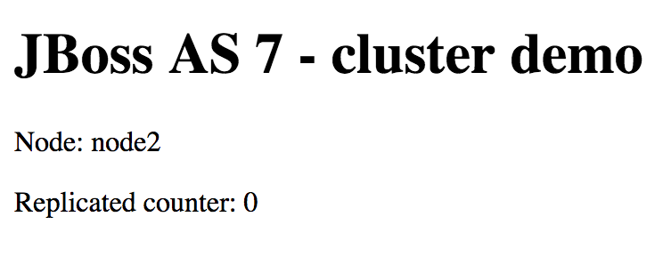
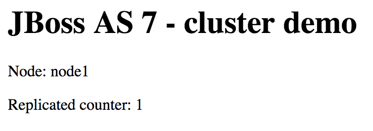

# EAPClusteringHowTo

Assumptions:

- We will be using a virtual box image of RHEL Enterprise Server 7.3. To make things simple, we will use "bridge" networking for the VM.

You need to download the following software in order to set this up:

- Enterprise Application Platform - Register as a developer in developer.redhat.com and download the installer [https://developers.redhat.com/download-manager/file/jboss-eap-6.4.0.GA-installer.jar]

- Apache http server with mod_cluster modules: http://downloads.jboss.org/mod_cluster//1.3.1.Final/linux-x86_64/mod_cluster-1.3.1.Final-linux2-x64.tar.gz 

1. Create directory $HOME/eap_cluster
   cd $HOME
   mkdir eap_cluster

2. Install the EAP server into directory $HOME/eap_cluster/node1
3. Copy the directory node1 into node2
   ```bash
      cd $HOME/eap_cluster
      cp -r node1 node2
   ```
4. Edit configuration for node1 and look for the <interfaces> element. Change the bind address of "public" to the IP address of your VM.
   ``` bash
      cd $HOME/eap_cluster/node1
      vi standalone/configuration/standalone-ha.xml 
   ```
  In the example below, the bind address of public is set to 192.168.1.238.

   ```
   <interfaces>
           <interface name="management">
               <inet-address value="${jboss.bind.address.management:127.0.0.1}"/>
           </interface>
           <interface name="public">
               <inet-address value="${jboss.bind.address:192.168.1.238}"/>
           </interface>
           <interface name="unsecure">
               <inet-address value="${jboss.bind.address.unsecure:127.0.0.1}"/>
           </interface>
       </interfaces>
   ```
5. Do the same for node2
6. Create a file run.sh in node1 containing the following:
   ```bash
   cd $HOME/eap_cluster/node1
   echo './bin/standalone.sh -Djboss.node.name=node1 --server-config=standalone-ha.xml' >> run.sh
   chmod +x run.sh
   ```
7. Do the same for node2:
   ```bash
   cd $HOME/eap_cluster/node2
   echo './bin/standalone.sh -Djboss.node.name=node2 --server-config=standalone-ha.xml -Djboss.socket.binding.port-offset=100' >> run.sh
   chmod +x run.sh
   ```
8. Clone the repository https://github.com/akquinet/jbosscc-as7-examples.git
   ```bash
   cd /tmp
   git clone https://github.com/akquinet/jbosscc-as7-examples.git
   ```
9. Cd to cluster-example directory and build using maven:
   ```bash
   cd /tmp/jbosscc-as7-examples/cluster-example
   mvn package
   ```
10. After the build, copy the generated war file to the deployments directory of node1 and node2:
   ```bash
   cp target/cluster-example-1.0-SNAPSHOT.war $HOME/eap_cluster/node1/standalone/deployments
   cp target/cluster-example-1.0-SNAPSHOT.war $HOME/eap_cluster/node2/standalone/deployments
   ```
11. Open another terminal and run node1:
   ```bash
   cd $HOME/eap_cluster/node1
   ./run.sh
   ```
12. Open a second terminal and run node2:
   ```bash
   cd $HOME/eap_cluster/node2
   ./run.sh
   ```
13. Download http://downloads.jboss.org/mod_cluster//1.3.1.Final/linux-x86_64/mod_cluster-1.3.1.Final-linux2-x64.tar.gz and as root unzip to / folder.
   ```bash
   cd /tmp
   wget http://downloads.jboss.org/mod_cluster//1.3.1.Final/linux-x86_64/mod_cluster-1.3.1.Final-linux2-x64.tar.gz
   cd /
   tar xzf /tmp/mod_cluster-1.3.1.Final-linux2-x64.tar.gz
   ```
   This should extract the package to /opt/jboss directory.

14. If you enabled SELinux, you need to add the port 6666:
   ```bash
   semanage port -a -t http_port_t -p tcp 6666
   ```
15. Cd to /opt/jboss/httpd and run the http server:
   ```bash
   cd /opt/jboss/httpd/
   ./sbin/apachectl start
   ```
16. You should see the following line in the console of both node1 and node2:
   ```
   11:45:15,481 INFO  [org.jboss.modcluster] (ContainerBackgroundProcessor[StandardEngine[jboss.web]]) MODCLUSTER000011: jboss.web will use a4b9f704-70e7-3382-bf8d-21b481e81bf6 as jvm-route
   ```
17. Test your cluster. Navigate to http://192.168.1.238/cluster/index.jsf

   You should see something like:
   

18. If the page is being served by node1 (or node2), go the the terminal of node1 (or node2) and kill the process.
19. Reload your browser. If should serve you the page by node2 (or node1).

   


